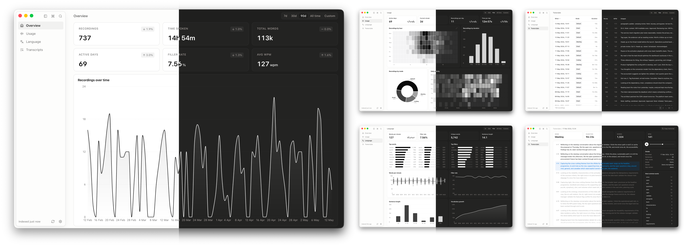

# SuperWhisper Analytics (unofficial)

A local Mac desktop app for browsing your SuperWhisper recording history. Reads your recordings from disk, never sends them anywhere. No telemetry. No accounts.

Built because I dictate constantly with [SuperWhisper](https://superwhisper.com) and wanted a way to look at my own usage data. **Personal project, not affiliated with SuperWhisper.** Shared in case it's useful to anyone else.



## Install

Grab the `.dmg` from the [latest release](https://github.com/aicayzer/superwhisper-analytics/releases/latest), open it, and drag `SuperWhisper Analytics.app` into `/Applications`. The release is signed with an Apple Developer ID and notarised, so macOS opens it without the Gatekeeper warning.

### Build from source

```bash
pnpm install
pnpm build:mac
```

The build drops a `.dmg` into `dist/`. A source build is unsigned, so macOS flags it on first launch — right-click the app in Finder and select **Open**, or run:

```bash
xattr -d com.apple.quarantine "/Applications/SuperWhisper Analytics.app"
```

### First launch

The app asks for your SuperWhisper recordings folder and tries to auto-detect the default location:

```
~/Library/Application Support/com.superduper.superwhisper/recordings
```

If yours lives elsewhere (custom install, external drive), point the picker at it. The first time the app reads anything under `~/Library/Application Support`, macOS shows a Files-and-Folders permission dialog — allow it.

## What it shows

- **Overview** — totals, KPIs, when-you-record heatmap, daily activity.
- **Usage** — by-hour clock, mode share, words-per-minute by mode.
- **Language** — top words, filler words, speaking pace, sentence-length distribution, vocabulary growth.
- **Transcripts** — every recording with click-through to a detail view (audio playback, segment-clickable transcript, hover-to-highlight word frequency).

All views are scoped to the date-range pill in the navbar.

## Where it stores data

A single config file at:

```
~/Library/Application Support/me.cyzr.superwhisper-analytics/config.json
```

Holds the recordings-folder path, your filler-phrase dictionary, and a few toggles. The recordings themselves stay in your SuperWhisper folder; the app reads them on launch and re-reads when you click **Reindex** in Settings.

No network calls except the **View on GitHub** link.

## Develop

```bash
pnpm dev          # electron-vite dev shell with hot reload
pnpm typecheck    # tsc, both node + web projects
pnpm lint         # eslint
pnpm format:check # prettier --check
pnpm test         # vitest
pnpm build        # production build (Vite)
pnpm build:mac    # full packaged .app + .dmg via electron-builder
```

See [CONTRIBUTING.md](CONTRIBUTING.md) for the contribution workflow.

## Stack

Electron + Vite + React 19 + TypeScript (strict). Tailwind v4 + ShadCN/UI for the design system, Recharts for charts, Zustand for state, React Router (HashRouter) for routing. pnpm for package management. macOS only — no Windows/Linux build paths.

## Architecture

Briefly:

- **Electron** with three processes — `main/` (Node; owns the disk + IPC + custom protocol), `preload/` (typed bridge), `renderer/` (React + Vite).
- **Shared types** in `src/shared/types.ts` — `Recording`, `Aggregates`, `HydratePayload`. Both processes pull from here so the IPC contract stays in lockstep.
- **Scanner** reads each `meta.json`, derives metrics, sorts newest-first. ~200ms for 11k recordings, so synchronous.
- **Aggregates** are pure functions over the parsed `Recording[]`.
- **`sw://` custom protocol** streams `output.wav` files to the renderer's `<audio>` element — the renderer never touches `file://` directly.

## Acknowledgements

Thanks to the team behind [SuperWhisper](https://superwhisper.com) for building the app this one is built around. The data model, the modes system, and the clean on-disk format are what made this side project possible.

## License

[MIT](LICENSE). This project doesn't intend to infringe upon SuperWhisper's intellectual property — if anyone at SuperWhisper has concerns, email **hello@cyzr.me** and I'll do whatever you ask.
